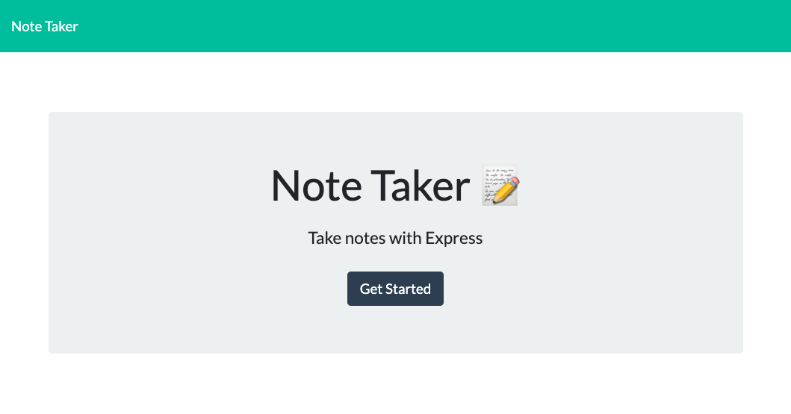

# note-taker

## Description
JavaScript application for adding, saving and deleting notes

## Table of Contents
#### [Installation](https://github.com/CD-prog/readme-generator#installation-1)
#### [Usage information](https://github.com/CD-prog/readme-generator#usage-information-1)
#### [License](https://github.com/CD-prog/readme-generator#license-1)
#### [Contributing](https://github.com/CD-prog/readme-generator#contributing-1)
#### [Tests](https://github.com/CD-prog/readme-generator#tests-1)
#### [Questions](https://github.com/CD-prog/readme-generator#questions-)

## Installation
npm install -> node server

## Usage information
https://intense-citadel-84040.herokuapp.com/

## License
MIT

## Contributing
Pull requests welcome

## Tests
N/A

## Questions ?
### https://github.com/https://github.com/CD-prog
### c.diaconeasa@gmail.com
